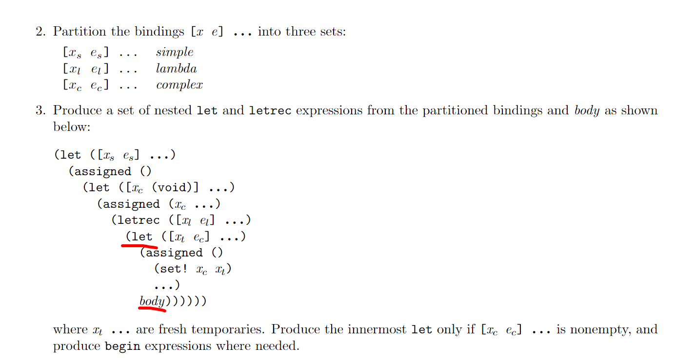
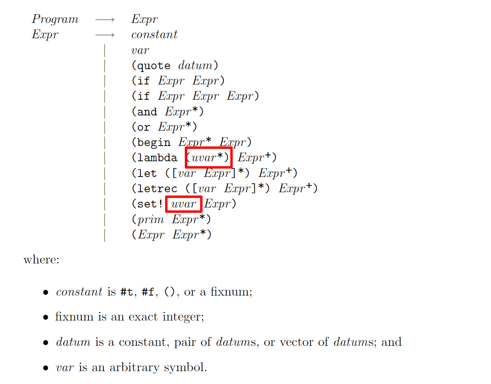

# Notice

> Update 2024.5.27

- Since syntax check can be done in a15, we don't require you to implement the two passes `verify-scheme` and `verify-uil`. Feel free to program with them. An implementation that just returns the input as output is accepted.
- We suggest you using `match` macro in your compiler. Please read `docs/Using Match.mhtml` first to get familiar with it.

> Update 2024.6.4
- Before you begin your coding in `a1`, make a new directory named `output` in the project directory. This is used to store the output assembly language and the `.o` file.
- Do not merge all branches in advance!!! Instead, merge the new one after you have completed the previous one. When facing merge-conflict, always choose the incoming changes instead of the former one.
- Do not load `.scm` in each pass. It's enough for you to load it in your main program at once.

## a14

> Update 2024.6.26
- In `convert-complex-datum`, the conversion of quoted vector should be
```
(let ([tmp.1 (make-vector '3)])
    (begin
        (vector-set! tmp.1 '0 '32)
        (vector-set! tmp.1 '1 (cons '33 (cons '33 '())))
        (vector-set! tmp.1 '2 '34)
        tmp.1))
```
- In `purify-letrec`, output of the 3th step should be
```
(let ([xs es] ...)
    (assigned ()
    (let ([xc (void)] ...)
        (assigned (xc ...)
            (letrec ([xl el] ...)
                (begin 
                    (let ([xt ec] ...)
                        (assigned ()
                            (set! xc xt)
                            ...))
                    body
                ))))))
```


## a15

> Update 2024.6.26
- All `uvar` in input grammar should be `var`. The `uvar*` is a typo.
